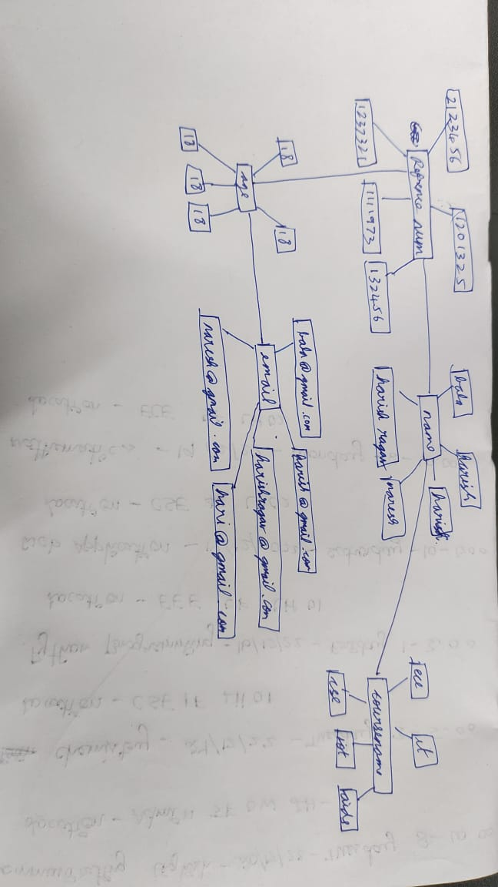
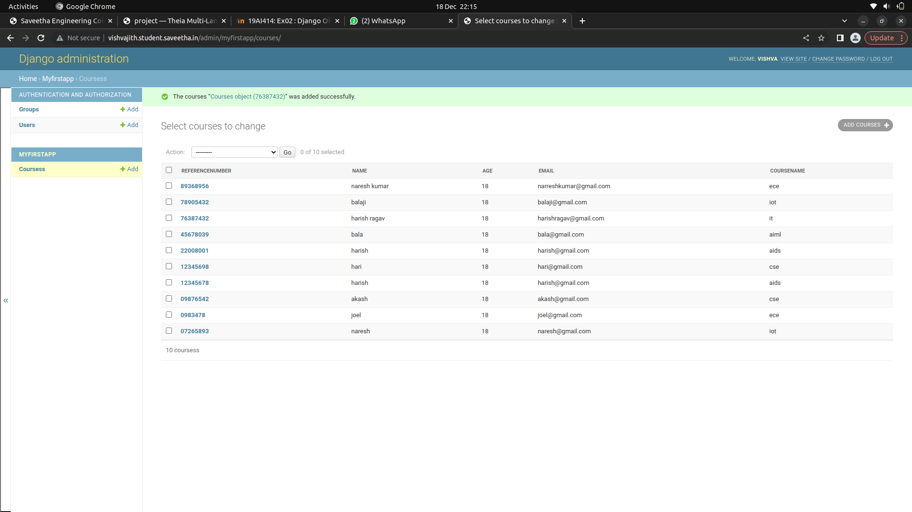

# Django ORM Web Application

## AIM
To develop a Django application to store and retrieve data from a database using Object Relational Mapping(ORM).

## Entity Relationship Diagram



## DESIGN STEPS

### STEP 1:
create a course details of students

### STEP 2:
enter a code of ORM
### STEP 3:
Push the code to github


## PROGRAM

```
from django.db import models
from django.contrib import admin

class Courses(models.Model):
    referencenumber = models.CharField(max_length=8,primary_key=True)
    name = models.CharField(max_length=100)
    age = models.IntegerField()
    email = models.EmailField()
    coursename=models.CharField(max_length=100)


class CoursesAdmin(admin.ModelAdmin):
    list_display = ('referencenumber','name','age','email','coursename')
        
```

## OUTPUT




## RESULT
thus the experiment executed sucessfully